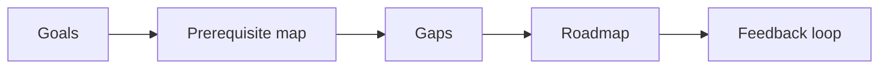

# 07 - Personalized Learning Path Agent

[](https://github.com/milos-plavsic/personalized-learning-path-agent/actions/workflows/ci.yml)
[](https://www.python.org/downloads/)

An adaptive learning assistant that builds and continuously updates skill roadmaps using user goals, progress signals, and prerequisite graph reasoning.

## Real-world data (education sector)

The `/v1/roadmap` response augments your goal with a **cohort risk summary** trained on **`data/student-por.csv`** from the UCI *Student Performance* dataset (Portuguese language course, secondary school): [UCI ML Repository — Student Performance](https://archive.ics.uci.edu/dataset/320/student+performance). The model estimates **at-risk students** (final grade `G3` < 10) without using prior period grades `G1`/`G2` as inputs, then surfaces top **Random Forest** feature importances as suggested priorities.

## Quickstart

```bash
make install
make run
make api
make test
```

Docker API: `make docker-api`.

## API

- OpenAPI docs: `http://127.0.0.1:8000/docs`
- Health: `GET /health`
- Roadmap: `POST /v1/roadmap` with JSON body `{"goal":"..."}`

## Architecture



## Core Capabilities

- User skill profile and goal intake.
- Prerequisite graph traversal to identify skill gaps.
- Weekly personalized roadmap generation.
- Progress-aware plan adjustment and motivation nudges.
- Time-to-mastery estimates using lightweight predictive model.

## Architecture (Graph)

`profile_ingest -> goal_parser -> prerequisite_mapper -> gap_analyzer -> roadmap_planner -> schedule_optimizer -> feedback_processor -> roadmap_update`
